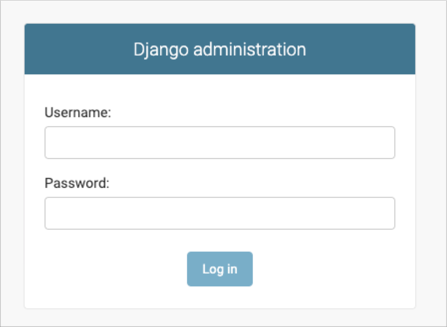
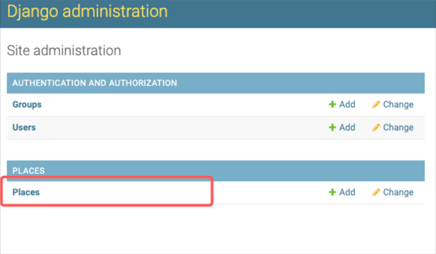
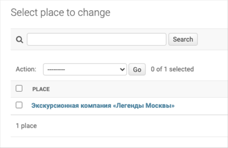
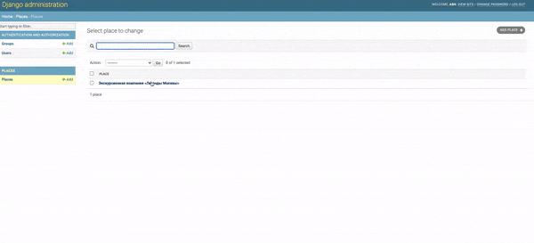

# Where To Go (WTG):
A website for the tourists in Armenia where they can find an interesting places to visit.

### Where is the website?
Just click [here](https://ash28003.pythonanywhere.com/).

### How to add more content?
- Move to the admin panel of your website (`127.0.0.1:8000` or if you already deployed go to your `<username>.pythonanywhere.com`)
add `/admin` at the end of you website address.



- After log in go to Places:



- Then you can find the location in the search field or choose from the list and add
a new place clicking on Add place on the right side of the admin panel:



After all this steps you can manage post. Note that you can swap uploaded images:



To add a new user with access to manage data go to Users catalog and create a new user,
then in Permissions add Staff status and set User permissions.

Also you can add new placed via loading JSON files with place data in it.
The JSON file must have structure like this:
```json
{
    "title": "Yerevan Cascade Complex",
    "imgs": [
        "https://raw.githubusercontent.com/Ash2803/places_for_WTG/main/media/casc.jpg",
        "https://raw.githubusercontent.com/Ash2803/places_for_WTG/main/media/casc1.png",
        "https://raw.githubusercontent.com/Ash2803/places_for_WTG/main/media/casc2.jpg",
        "https://raw.githubusercontent.com/Ash2803/places_for_WTG/main/media/cascade.jpg"
    ],
    "description_short": "Yerevan has several must-see places, but the Cascade Complex is perhaps the most superb and memorable one.",
    "description_long": "<p>It is an architectural masterpiece that occupies a large part of Yerevan’s center and a great opportunity for travelers who are looking for free things to do in Yerevan. The complex was designed by the legendary Armenian architect Alexander Tamanyan, who was the main architect of Yerevan city. Although he designed it, the Yerevan Cascade Complex was built after Tamanyan’s death in the 1970s and over time became one of the main places to visit in Yerevan. Erected from limestone, this mesmerizing monument is a one-of-a-kind structure that is basically an enormous staircase. It connects northern Yerevan to the center in a very unique way. The Yerevan Cascades has several levels and each level has a different look and design to it.</p>",
    "coordinates": {
        "lng": "44.515533",
        "lat": "40.19068"
    }
}
```
To add place via JSON use the command:
`python manage.py load_place -l <put here link to the json file>`

### How to execute:

- Download or clone [repo](https://github.com/Ash2803/where-to-go.git)
- You must have Python 3.9 or higher already installed;
- Create the virtual environment using command:
```
python3 -m venv venv
```
- Install the requirements using command:
```
pip install -r requirements.txt
```
Create `.env` file and set environment variables:
- `SECRET KEY` - your project secret key:
- `DEBUG` = default is `False`. To enable debug mode set value to `True`;
- `MEDIA_ROOT` = you can set your path where the media files will be stored, default = `media/`;
- `MEDIA_URL` = default = `/media/`;
- `STATIC_URL` = default = `/static/`;

Then create a DB by running `makemigrations` and `migrate` command:
```
python manage.py makemigrations
python manage.py migrate
```
- Create superuser and put your login, email and password:
```
python manage.py createsuperuser
```
- Run the server:
```
python manage.py runserver
```

Read the section ["How to add more content?"](#how-to-add-more-content) to find out how to add new data to website.

### Project Goals

The projects made for educational purposes at online-course for web-developers [dvmn.org](https://dvmn.org/)
